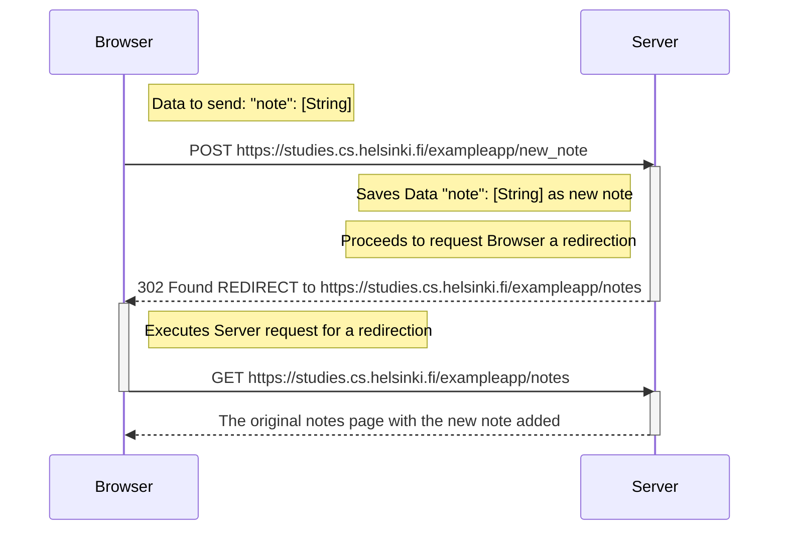

# New Note Diagram

```mermaid
sequenceDiagram
    participant Browser
    participant Server

    Note right of Browser: Data to send: "note": [String]

    Browser->>Server: POST https://studies.cs.helsinki.fi/exampleapp/new_note
  
    
    activate Server
    Note left of Server: Saves Data "note": [String] as new note
    Note left of Server: Proceeds to request Browser a redirection 
    Server-->>Browser: 302 Found REDIRECT to https://studies.cs.helsinki.fi/exampleapp/notes
    deactivate Server

    activate Browser
       
    Note right of Browser: Executes Server request for a redirection  
    
    Browser->>Server: GET https://studies.cs.helsinki.fi/exampleapp/notes
    deactivate Browser

    activate Server
    Server-->>Browser: The original notes page with the new note added
    deactivate Server
```
